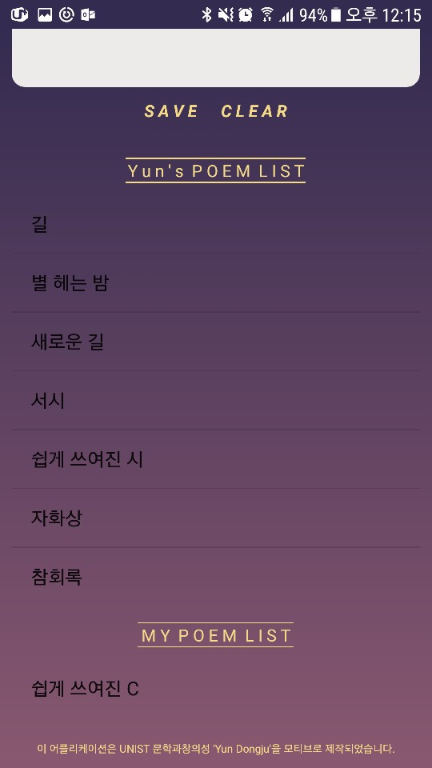

# Poem-Yun
This application is inspired by lecture 'Yun Dongju' of Literature and Creativity, UNIST

Yun Dongju was a Korean poet. (1917 - 1945)
Known for his lyric poetry as well as resistance poetry.
You can see more details in [here](https://en.wikipedia.org/wiki/Yun_Dong-ju)

This application contains his poetical works _Sky, Wind, Star and Poem_. I hope many people enjoy his poem and know his life.

You can download this application on 
[google play store](https://play.google.com/store/apps/details?id=com.literature.eoghk.yunpoem)

## On wallpaper

You can see Yun Dongju's poem on your wallpaper. This is changed every __30 min__.

## Splash screen : see his life

You can see some facts about Yun Dongju.

## fill your poem

You can write your own poem.

## Poem list

You can see Yun's poem and your poem separately.

## See poem immediately

When click the poem in list, you can see poem
